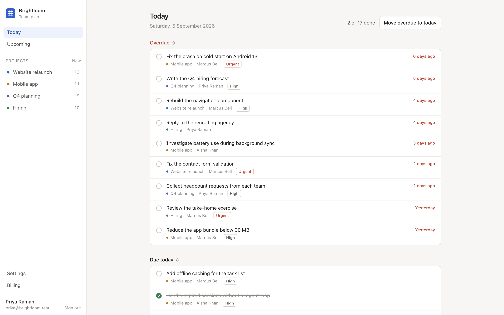

# Brightloom

Brightloom is a small task and billing app for teams. People sign in, see what is due
today and in the next two weeks, work through tasks inside projects, comment on them,
and manage their plan and invoices. It runs as a single Node process that serves both
the API and the web app.



## Getting started

You need Node 22 or later and pnpm.

```
pnpm install
pnpm seed
pnpm dev
```

That brings the app up on http://localhost:4100. The Vite dev server runs on 4100 and
proxies API calls to the Hono server on 4101.

For a production style run:

```
pnpm build
pnpm start
```

`pnpm start` serves the built web app and the API from one process on port 4100. Set
`PORT` to use a different one.

## Seeded accounts

`pnpm seed` drops the database and rebuilds it, so you can run it whenever you want a
clean slate. Due dates are relative to the day you seed, which keeps the Today and
Upcoming screens populated.

Two organisations are created. Every account uses the password `demo-pass-2026`.

| Organisation | Accounts |
| --- | --- |
| Brightloom | priya@brightloom.test (owner), marcus@brightloom.test, aisha@brightloom.test |
| Northwind Labs | dana@northwind.test (owner), lee@northwind.test |

## Scripts

| Command | What it does |
| --- | --- |
| `pnpm dev` | Vite dev server on 4100 plus the API server on 4101 |
| `pnpm build` | Compiles the server, builds the web app, writes `openapi/openapi.json` |
| `pnpm start` | Runs the built app on port 4100 |
| `pnpm seed` | Recreates `data/brightloom.db` with the sample data |
| `pnpm typecheck` | Type checks the server and the web app |
| `pnpm test` | Runs the API tests |
| `pnpm openapi` | Regenerates `openapi/openapi.json` |

## The API

Everything lives under `/api/v1`. Sign in with `POST /api/v1/auth/login`, which sets an
httpOnly `bl_session` cookie. Every other endpoint except the billing webhook needs that
cookie.

```
curl -c cookies.txt -X POST http://localhost:4100/api/v1/auth/login \
  -H 'Content-Type: application/json' \
  -d '{"email":"priya@brightloom.test","password":"demo-pass-2026"}'

curl -b cookies.txt http://localhost:4100/api/v1/tasks?due=today
```

The full OpenAPI 3.1 document is served at http://localhost:4100/openapi.json and is
checked in at `openapi/openapi.json`. It is generated from `src/server/openapi.ts`, so
edit that file rather than the JSON.

## Layout

```
src/server/     Hono app, routes, database access, the OpenAPI document
src/scripts/    seed script and the OpenAPI writer
src/ui/         React app
openapi/        the generated OpenAPI document
test/           API tests
data/           the SQLite file, not committed
```

Data lives in SQLite through better-sqlite3, at `data/brightloom.db`. There is no ORM,
just prepared statements in `src/server/queries.ts` and the route files.

## Tests

```
pnpm typecheck
pnpm test
```

The tests build the app against a throwaway database in the system temp directory, so
they do not touch your local `data/brightloom.db`.
